<!DOCTYPE html>
<html lang="en">
<head>
    <meta charset="UTF-8">
    <meta name="viewport" content="width=device-width, initial-scale=1.0">
    <title>30-Day Map Challenge</title>
    
</head>
<body>

<h1>30-Day Map Challenge</h1>

Daily Challenge Entries

<!-- Gallery Container -->

    <a href="data/Day1.JPG" target="_blank" class="gallery-item">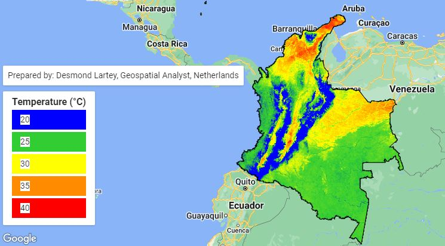</a>
    <a href="data/Day2.png" target="_blank" class="gallery-item">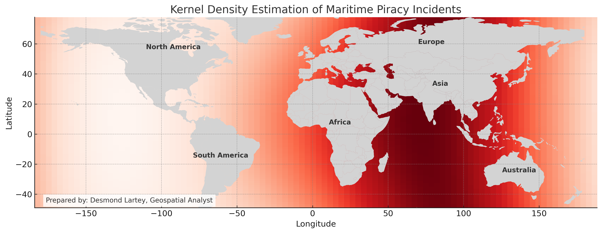</a>
    <a href="data/Day3.gif" target="_blank" class="gallery-item">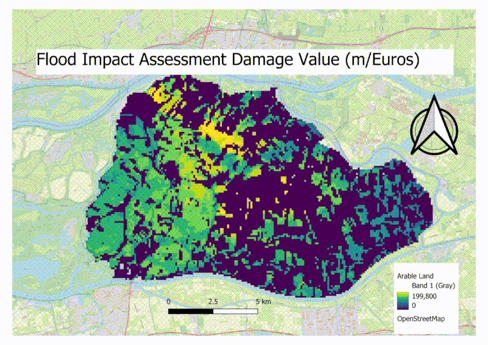</a>
    <a href="data/Day4.png" target="_blank" class="gallery-item">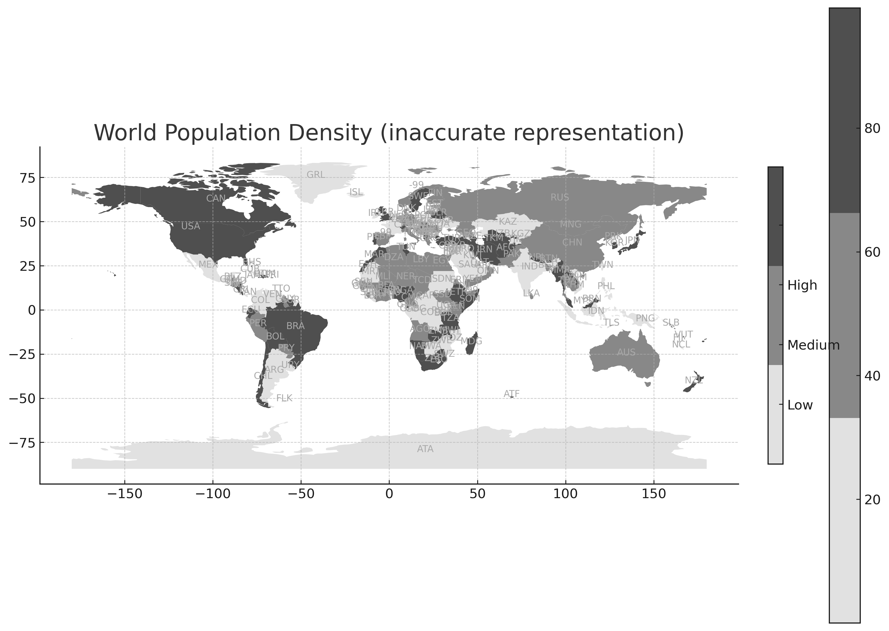</a>
    <a href="data/Day5.jpg" target="_blank" class="gallery-item">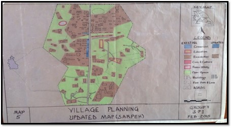</a>
    <a href="data/Day6.jpg" target="_blank" class="gallery-item">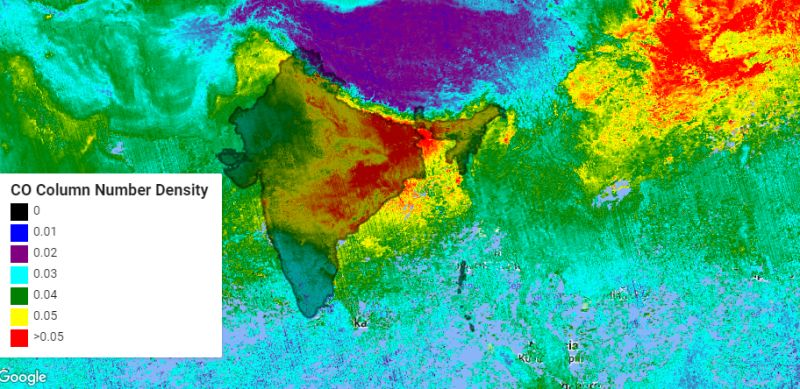</a>
    <a href="data/Day7.PNG" target="_blank" class="gallery-item">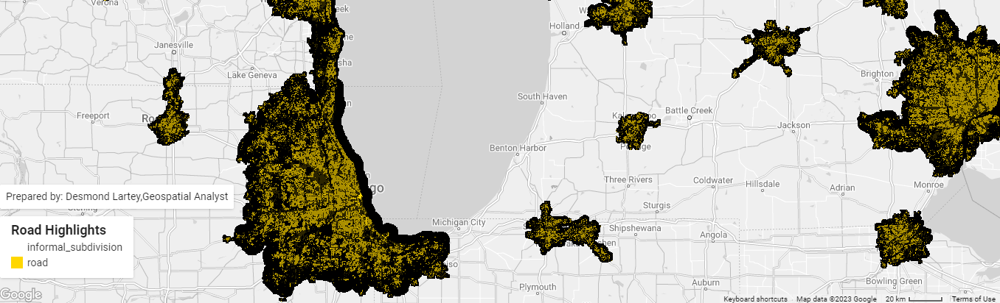</a>
    <a href="data/Day8.png" target="_blank" class="gallery-item">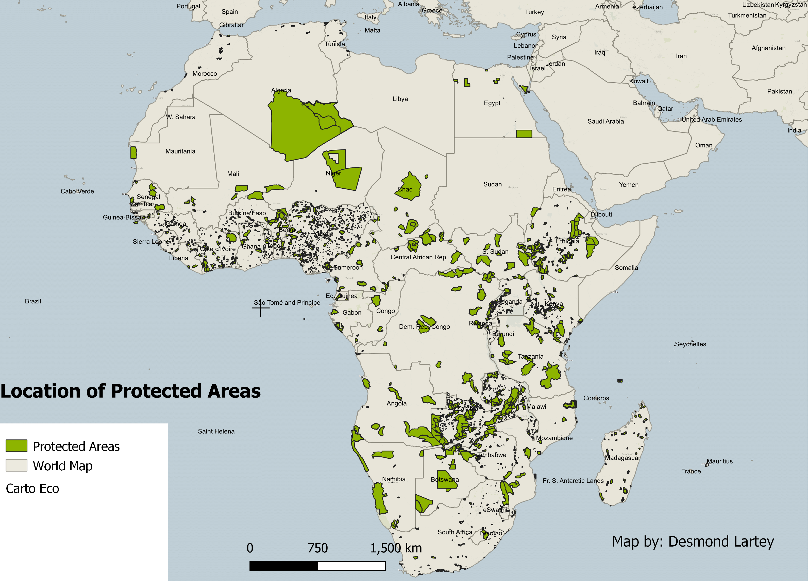</a>
    
    <a href="data/Day12.PNG" target="_blank" class="gallery-item">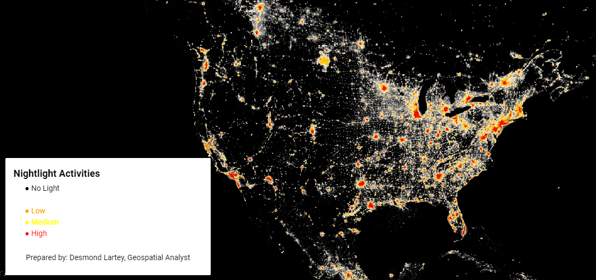</a>
    <a href="data/Day121.PNG" target="_blank" class="gallery-item">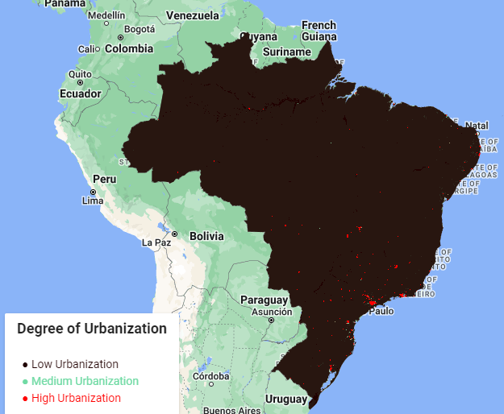</a>
    
    <a href="data/Day14.PNG" target="_blank" class="gallery-item">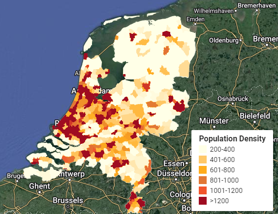</a>
    <a href="data/Day15.jpg" target="_blank" class="gallery-item">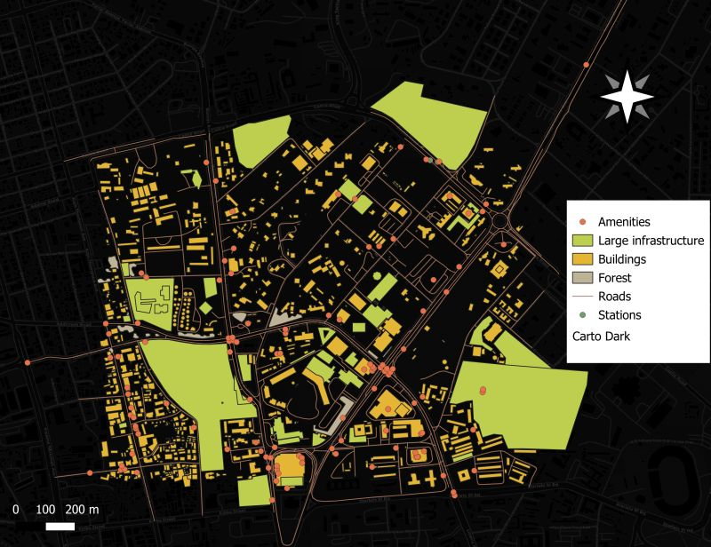</a>
    
    <a href="data/Day17.jpg" target="_blank" class="gallery-item">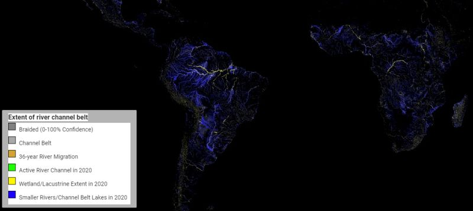</a>
    
    
    <a href="data/Day21.gif" target="_blank" class="gallery-item">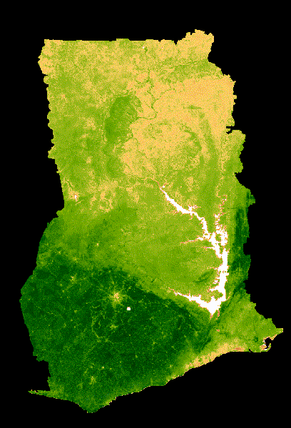</a>
    
    <a href="data/Day24.png" target="_blank" class="gallery-item">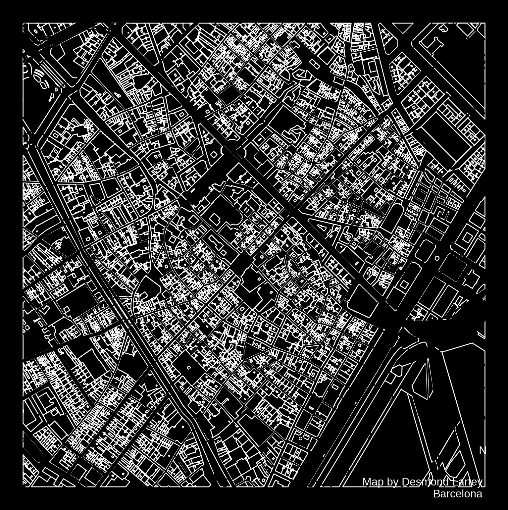</a>
    <a href="data/Day25.png" target="_blank" class="gallery-item">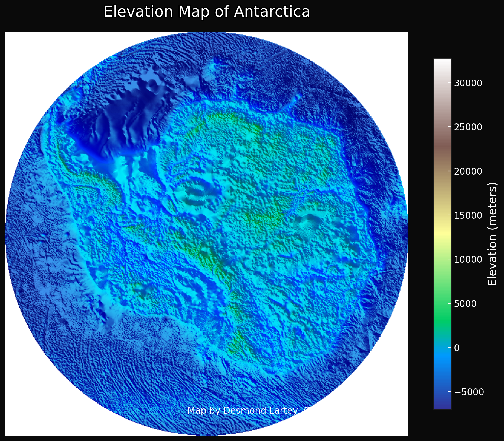</a>
    <!-- Add more images as needed -->

</body>
</html>
