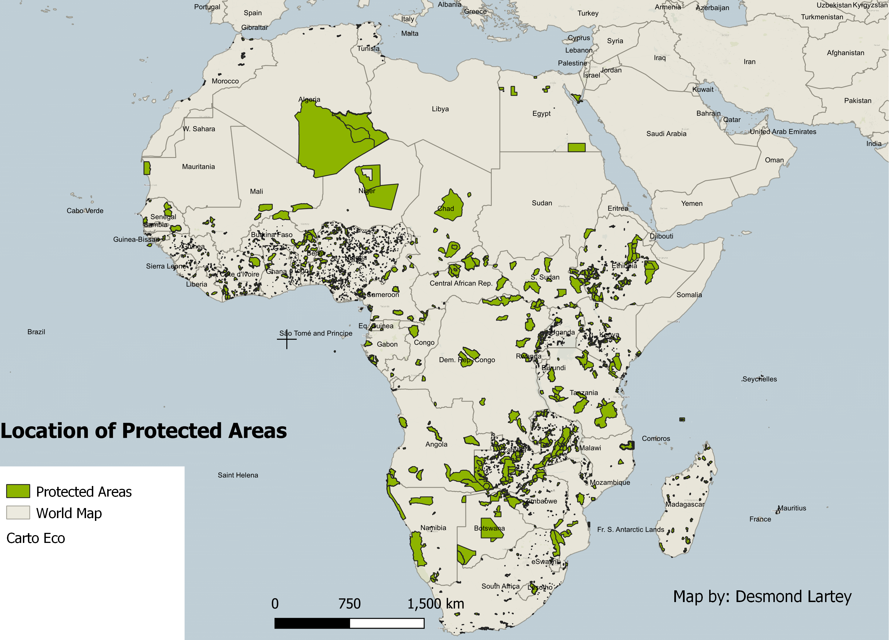
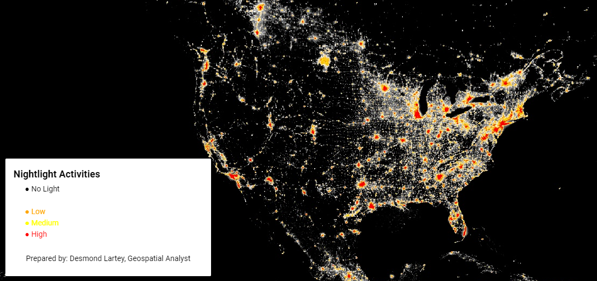

# 30-day Map Challenge

This November, we embark on the #30dayMapChallenge—a stimulating and creative endeavor that invites professionals, students, and enthusiasts in the geospatial and cartographic realms to craft and share a new map each day, based on a set of themes. Here's why I believe this challenge is more than just a test of skills, but a gateway to profound learning and community engagement:

- **🔍 Intensive Learning**: Each day poses a new theme, pushing us to dive into diverse datasets, explore various software and tools, and experiment with different cartographic techniques. It's a hands-on crash course in the art and science of map-making.
- **👩‍💻 Skill Enhancement**: Whether you're a GIS veteran or a curious newcomer, the challenge scales to your level. From basic data plotting to advanced spatial analysis, every map is a chance to polish old skills or develop new ones.
- **🌟 Creative Expression**: Maps are more than data—they tell stories, highlight issues, and celebrate the beauty of our world. This challenge is a canvas for creativity, where each participant adds their unique perspective.
- **🔄 Feedback and Growth**: Sharing your maps with a global community invites constructive critiques, fresh ideas, and encouragement. It's a collaborative learning experience that sharpens us all.
- **💡 Educational Impact**: By discussing the principles of good cartography, as seen in our recent 'bad map' exercise, we shed light on the dos and don'ts of effective communication through maps.
- **🔗 Networking**: Engage with a network of geospatial professionals, academics, and hobbyists. The #30dayMapChallenge is as much about building connections as it is about building maps.
- **🌱 Sustainable Development**: Many themes are aligned with environmental and societal issues, echoing the UN's Sustainable Development Goals (SDGs). Maps can influence policy, drive change, and make a real-world impact.

## What to Expect?
Throughout the challenge, I'll be sharing:
- Daily maps based on the given themes.
- Insights into the tools and data used for each map.
- Reflections on what each theme brings to the forefront of our understanding of geospatial data and cartography.

## Stay Connected
For daily updates and to see my maps, follow me on [LinkedIn](https://www.linkedin.com/in/desmond-lartey/). Let's navigate this challenge together—charting the course of our learning, one map at a time!

## Daily Challenge Entries

<!--### Day 1: [Theme Title]-->
<!--**Theme Description:**-->

<!--**Map Image:**-->

<!--**Reflections:**-->

<!--**Map Image:**-->

<!--**Map Image:**-->

<!--**Map Image:**-->

<!--**Map Image:**-->

<!--**Map Image:**-->

<!--**Map Image:**-->

<!--**Map Image:**-->

<!--**Reflections:**-->

<!--**Map Image:**-->

<!--**Map Image:**-->

<!--**Map Image:**-->

<!--**Map Image:**-->

<!--**Map Image:**-->

<!--**Map Image:**-->

<!--**Map Image:**-->

<!--[...repeat sections for Day 2 through Day 30...]-->

<!--### Day 30: [Theme Title]-->
<!--**Theme Description:**-->

<!--**Map Image:**-->
<!---->

<!--**Reflections:**-->
<!--- Add your reflections or any other information here.-->
